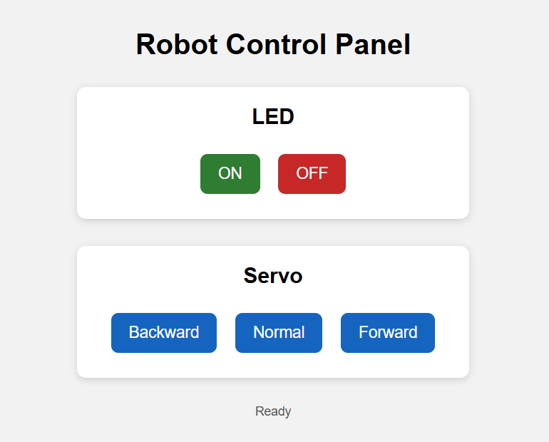
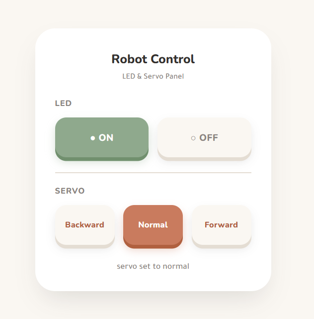
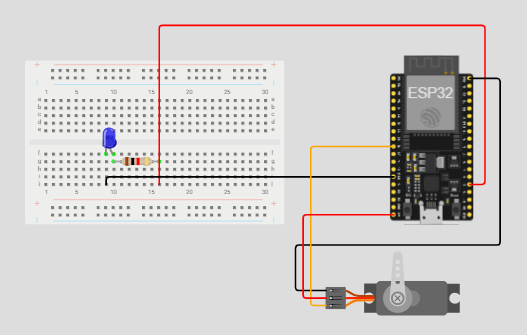
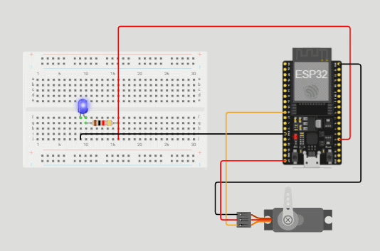

# LED-Servo-Control-Panel-ESP32

## Overview

This project is a web-based control panel for controlling an **LED** and a **servo motor** through an **ESP32** microcontroller. The web interface sends commands to a database, and the ESP32 polls the server to read the current state and physically drive the LED and servo in real time.

The project was developed through several stages: setting up the database and backend, building the LED/servo web interface and styling it, solving a hosting-related connectivity issue, testing the circuit in Wokwi, and finally connecting the ESP32 hardware.

---

## Live Website

[**Open the Control Panel**](https://nassebah.infinityfreeapp.com/WebTask/)

## Robot State

The current LED and servo state can be viewed as a plain text code through:
[**View State**](https://nassebah.infinityfreeapp.com/WebTask/get_state.php)

The code is two characters: the first is the LED (`0`/`1`), the second is the servo position (`B` = backward, `N` = normal, `F` = forward). For example, `1F` means LED on, servo forward.

---

## 1. Database & Backend Setup

A database was created to hold the LED and servo state, using the table structure defined in `setup.sql`.

`update_command.php` accepts a `type` (`led` or `servo`) and a `value`, validates it, updates the corresponding column in the database, and writes the current combined state to `state.txt`.

`get_state.php` reads the current state directly from the database.

`db.php` holds the database connection credentials.

---

## 2. LED & Servo Web Controls

The web interface (`index.html`) has two control sections:
* **LED** — ON / OFF buttons
* **Servo** — Backward / Normal / Forward buttons

Each button sends a request to `update_command.php`, and the active selection is visually highlighted on the panel.

---

## 3. Styling

The interface (`style.css`) uses a **Soft Tactile Remote** style:
* Warm clay and sage color palette
* Rounded, pill-shaped buttons
* Pressed-in button animations
* Active-state highlighting (sage for LED ON, clay for LED OFF/selected servo position)

---

## 4. Solving the InfinityFree Connectivity Issue

When the ESP32 tried to fetch the state from `get_state.php`, it received InfinityFree's **JavaScript bot-protection challenge page** instead of the actual data. This challenge is designed to filter out non-browser requests and requires executing JavaScript to pass — something the ESP32 cannot do.

**Solution:** `update_command.php` was updated to also write the current state to a **static text file** (`state.txt`) after every database update. Since static files aren't wrapped in the same bot-protection layer as dynamically executed PHP pages, the ESP32 can fetch `state.txt` directly without being blocked.

---

## 5. Circuit Testing in Wokwi

Before wiring the physical hardware, the LED and servo circuit was tested and verified in the **Wokwi simulator** to confirm the pin connections and servo angle behavior.

---

## 6. ESP32 Integration

The ESP32 sketch (`RobotControl.ino`) polls `state.txt` over HTTP every few seconds, parses the two-character code, and drives the hardware accordingly:
* **LED** — turned on/off based on the first character
* **Servo (SG90)** — moved to one of three angles using the `ESP32Servo` library, based on the second character:
  * Backward → 0°
  * Normal → 90°
  * Forward → 180°

The sketch only moves the servo or toggles the LED when the state actually changes, avoiding unnecessary servo jitter.

### Hardware Demo

---

## Final Result

The final system provides:
* A web-based control panel for LED and servo control
* A live, pollable state accessible as a lightweight text file
* Real-time hardware control via an ESP32 connected over WiFi
* A verified circuit design tested in Wokwi before physical assembly

---

# 👩‍💻 Author

**Nassebah Al-Dubayyan**

Computer Science Student

⭐ If you found this project interesting, consider giving it a star!

